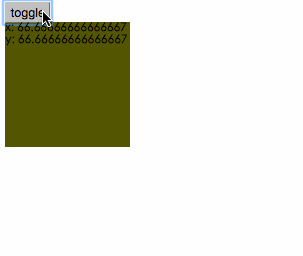
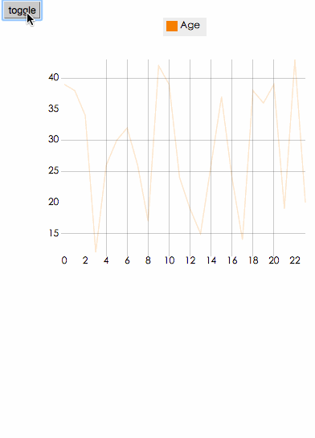

# react-d3-animation

Animation component in react-d3.

## NOTICE

UNDER DEVELOPMENT DON'T USE IN PRODUCTION

## Sample



#### Line Chart


## Support animate type

- color
- string
- array
- object

## Settings

- ease
- duration
- fps
- delay

## Example

```js
"use strict";

var React = require('react');
var ReactDOM = require('react-dom');

var Animation = require('../../lib/index').Animation;

// Example
(function() {
  var Container = React.createClass({
    getInitialState: function() {
      return{
        width: 100,
        height: 100,
        dataSet: {
          x: 0,
          y: 0
        },
        color: 'red'
      }
    },

    onClick: function() {
      this.setState({
        dataSet: this.state.dataSet.x === 0 ? {
          x: 100,
          y: 100
        }: {
          x: 0,
          y:0
        },
        width: this.state.width === 100 ? 200: 100,
        height: this.state.height === 100 ? 200: 100,
        color: this.state.color === 'red' ? 'green': 'red'
      })
    },

    render: function() {
      return (
        <div>
          <button onClick={this.onClick}>toggle</button>
          <Animation
            width= {this.state.width}
            height= {this.state.height}
            color= {this.state.color}
            data= {this.state.dataSet}
          >
            {function(state) {
              return (
                <div style= {{width: state.width, height: state.height, backgroundColor: state.color}}>
                  x: {state.data.x} <br/>
                  y: {state.data.y}
                </div>
              )
            }}
          </Animation>
        </div>
      )
    }
  })

  ReactDOM.render(
    <Container/>
  , document.getElementById('blank-animate')
  )

})()
```

## License

Apache 2.0
